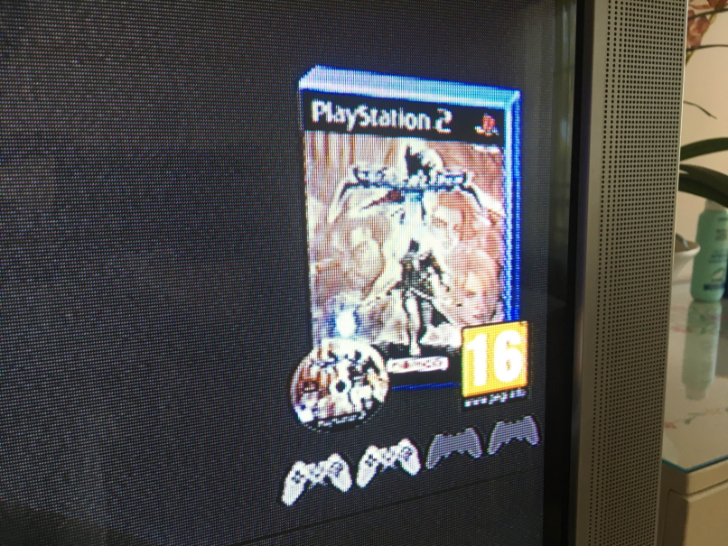

# OPL Theme - Edited

This repository contains a modified version of the default 1.0 OPL theme (also known as Korium).

### What's different?

* The GameID is now stored in the Game Info Menu (accessible by pressing Square). This information is placed before the game title.
* The disk size was removed from the Game Info Menu.
* A game's parental rating (PEGI only) is now included next to the box art.
* An icon representing the number of players is placed under the game's box art.

In order for this information to show up, you must configure the game in OPL Manager and copy the `CFG` folder over to your OPL folder.

### Installation

1) Put the `thm_Custom` folder inside the `THM` folder in your OPL directory. If the `THM` folder does not exist, create it. 
2) When you boot OPL, go into the menu, press Display Settings, and change the theme to `Custom`.

### Credits

All credits belong to the original creator (Berion), all I did was modify it to suit my needs. The source was pulled from the OPL GitHub repository, licensed under AFL-3.0.